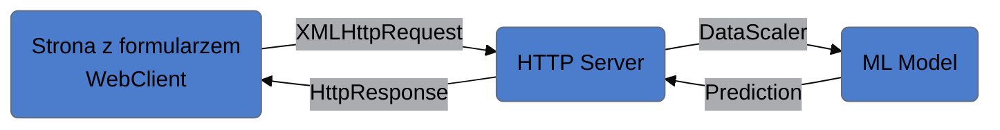

```mermaid
    %%{init: {'theme': 'base', 'themeVariables': { 'primaryColor': '#4b7dcc', 'secondaryColor': '#abacb0', 'primaryTextColor': '#000000'}}}%%
    flowchart LR
    P(Strona z formularzem<br>WebClient) -->|XMLHttpRequest| S(HTTP Server)
    S -->|DataScaler| ML(ML Model)
    ML -->|Prediction| S
    S -->|HttpResponse| P
```
